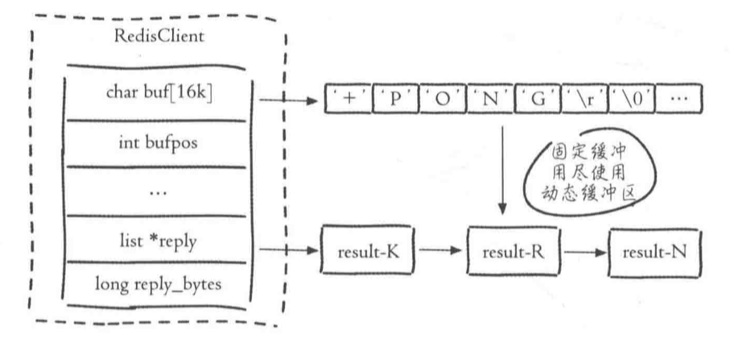
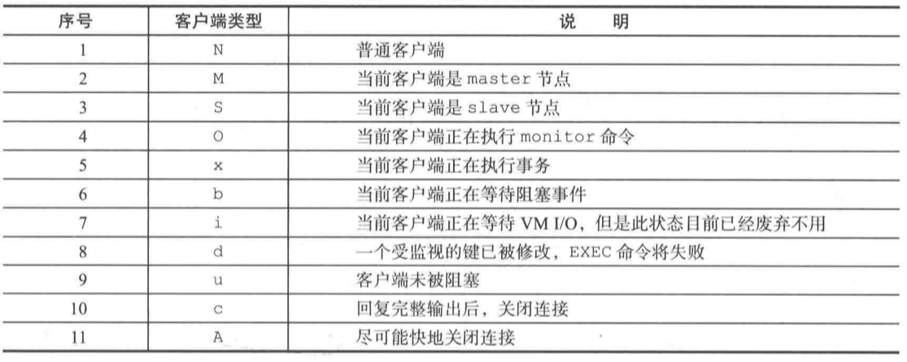
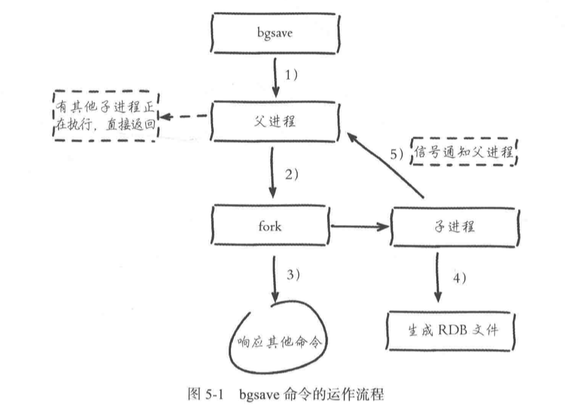
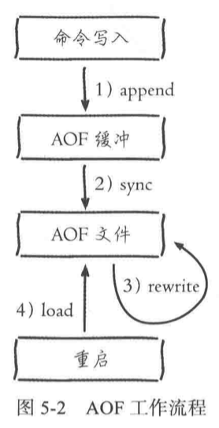

# Redis 学习笔记

## Redis的配置，启动，操作，关闭等。

Redis安装后，会有一些可执行文件被安装到/usr/local/bin目录下。

```shell
redis-server        # 启动Redis
redis-cli           # 客户端
redis-benchmark     # Redis基准测试工具
redis-check-aof     # Redis AOF持久化文件检测和修复工具
redis-check-dump    # Redis RDB持久化文件检测和修复工具
redis-sentinel      # 启动 Redis Sentinel
```

#### 启动

建议使用一下方法启动Redis

```shell
redis-server 配置文件.conf
```

#### 客户端连接服务器

使用redis-cli客户端可以链接服务器

```shell
redis-cli -h 127.0.0.1 -p 6379
```

也可以直接在后面增加命令行来取数据，如: 

```shell
redis-cli -h 127.0.0.1 -p 6379 command
```

redis-cli客户端是默认认为连接的是127.0.0.1和6379上的server，如果不加-h和-p也是可以的。

#### 关闭

```shell
redis-cli shutdown # 关闭redis服务器
```

```shell
redis-cli shutdown nosave | save # 是否在关闭之前生成持久化文件
```

## Redis API

简单的命令

```shell
set 键 值    # 设置某个键 对应某个 值
get 键        # 获得某个键对应的值

keys *      # 遍历每个键，显示所有键，O(n)
dbsize       # 键总数 O(1)

exists 键    # 判断某个键是否存在，返回int类型的，1为存在
del 键       # 删除某个键，可以连续删除多个键

expire 键 时间 # 将某个键设置为过一段时间后过期，过期后将被自动删除
expireat 键 时间戳 # 到对应时间戳时失效
ttl 键       # 获得某个键还能存活多久 -1为改键永远存在，-2为键不存在，其他为剩余时间

type 键      # 获得某个键下的值所对应的类型

mset 键 值 [键 值].... # 批量设置键值
mget 键 键 键 .....    # 批量获取键值

# 下面为比较不常用指令

append 键 值 # 在原有的键上添加对应的值，新值 = 原来值 + 需要添加的值
strlen 键    # 获得键对应值的长度
getset 键 值 # 设置某个键为某个值，如果键已经存在，则返回原来的键对应值
```

<font color=F0000> Redis执行效率非常高，但由于Redis是使用网络来进行传输指令， 所以指令的执行速度一定程度上也受网络影响，比如1000次get指令没有1次mget指令直接取1000个数据来的快。</font>

set指令有一些特殊选项，可以在设置键值的时候就设定选项

```shell
ex seconds: 为键设置秒级过期时间
px milliseconds: 为键设置毫秒级别过期时间
nx: 键必须不存在，用于添加新键
xx: 和nx相反，用于更新
```

例如:

```shell
set C++ Linux ex 10 # 设定键C++，值为Linux，存在10秒时间
set C++ Linux px 10 # 同上，存在10毫秒
set C++ Windows xx  # 更新C++的值为Windows
```

##### 发布订阅
略

##### Redis数据类型

type命令可以看到的数据类型是Redis想让看到的数据类型，内部还有很多编码用来实现这种`数据结构`。

各种数据类型的使用API

* 哈希

有点类似Redis里再套Redis一样，都是键对应值，至需要在命令前加上h即可。

```shell
hset 键 哈希键 哈希值 [哈希键 哈希值] ..# 设定对应哈希键值对，可以批量设定
hget 键 哈希键 # 获取对应哈希键值对
hdel 键 哈希键 # 删除对应哈希键值对
hlen 键 # 计算对应哈希键值对长度
hmeget 键 哈希键 [哈希键] .. # 批量获取键值对
hmset 键 哈希键 哈希值 [哈希键 哈希值] ..# 同上
hexists 键 哈希键 # 判断对应哈希键是否存在
hkeys 键 # 获取所以哈希键
hvals 键 # 获取所有哈希值
hgetall 键 # 次命令也可以获取所有哈希值
```

<font color=F0000> 哈希内部有两种编码，ziplist(压缩列表)和hashtable(哈希表)。当哈希元素小于hash-max-ziplist-entries时(默认512)，使用ziplist，可以节省更多内存，但是数量过多时，或者对应哈希值长度大于64Bytes时，使用ziplist会降低读写效率，Redis将自动切换编码类型。 </font>

* 列表

列表大多用于实现栈或者队列的东西

```shell
rpush 键 值 [值].. # 右边加入
lpush 键 值 [值].. # 左边加入
lrange 键 索引开始，索引结束 # 如果想要拿到全部，可以将索引结束定位-1
linsert 键 before | after 值1 值2 # 在值1之前插入值2 ｜ 在值1之后插入值2
lindex 键 索引 # 获取对应索引的值
llen 键 # 获取对应列表长度

rpop 键 # 从右边删除一个元素
lpop 键 # 从左边删除一个元素
blpop 键 超时时间 # 堵塞从左边删除元素，如果没有元素就等待某个时间才返回
brpop 键 超时时间 # 同上

lrem 键 总数 值 # 当总数大于0时，从左到右删除最多count次对应值的元素，总数小于0则从右往左删除，总数为0则删除全部对应值。

ltrim 键 索引开始 索引结束 # 保留索引开始到索引结束的值，类似切片，范围为前闭后闭。
lset 键 索引 新值 # 为对应索引设定新值
```

<font color=F0000> 内部编码类似哈希表，当长度小于list-max-ziplist-entries(默认)使用512，值list-max-ziplist-value(默认64字节)，超出以上条件将使用链表来进行实现。 </font>

使用 lpush + brpop可以使得列表变成消息队列

* 集合

集合和哈希表以及列表不同的是不允许存在相同元素

```shell
sadd 键 值 [值].. # 添加集合值
srem 键 值 [值].. # 删除集合值
scard 键 # 计算集合长度，O(1)
sismember 键 值 # 判断对应集合值是否存在
# ... 其余API略
```

<font color=F0000> 内部编码类似哈希表，当长度小于set-max-ziplist-entries(默认512)且都是整数时，将使用整数集合，超出以上条件将使用哈希表来进行实现。 </font>

* 有序集合

略

##### Redis的键管理

```shell
rename 键 新键 # 重命名键的名字，如果新键已经存在，会覆盖掉
renamex 键 新键 # 同上，不同的是新键已经存在则返回0失败
randomkey # 返回一个随机键
```

##### 单线程架构

三个客户端同时发起执行命令

```shell
# incr使得键对应值自增1，成功返回1，失败返回错误，如果不存在则创建对应键值
incr counter    # 客户端1
incr counter    # 客户端2
incr counter    # 客户端3
```

这些命令将同时发送到Redis服务器，不过执行指令将放到执行队列中去，具体执行顺序将有指令到达时间来决定(取决于网络延迟等)。


Redis使用了PipeLine的技术来解决这种问题，将一组命令组合合并起来发送到Redis服务器，服务器分批执行后一起返回给客户端。


需要注意，这种pipeline命令并不是原子性的，而原生如mget命令是原子性命令。并且Pipeline也不是没有缺点，如果承载的命令过多，也会因为执行时间过长而让客户端等待过久。


##### 数据分库

Redis默认存在16个数据库，各个数据库之间没有任何关联，每个数据库可以有自己的相同键等等。


```shell
select 索引 # 进行数据库切换
flushdb # 删除当前数据库所在的数据
flushall # 删除所有数据库中的数据
```

如果数据库中的键过多，使用删除全部键的操作可能导致其他客户端请求被阻塞。


## 事务

Redis也有事务功能

```shell
multi # 事务开始
# 此处为命令
exec # 事务结束
```

如果执行到了一半，想要中断事务，可以使用

```shell
multi
discard # 中断事务
```

如果执行发生错误，则事务将被强制结束。

需要注意的是，如果错误的是逻辑错误，而不是语法错误，那么事务将继续执行，比如A关注B写成了A关注C，由于语法没有错误，所以事务正常执行，但是Redis并不支持回滚操作！


## 客户端

Redis有3种客户端，即普通客户端，slave客户端，pubsub客户端。

Redis为每个客户的设定了一个指令输入输出缓冲区，


`hard limit` 如果客户的输出缓冲区使用超过这个值，客户端将被立即关闭。
`soft limit`和`soft seconds`如果客户端使用的输出缓冲区超过这个值，并且持续soft秒，则客户端被立即关闭。所以需要尽量增加slave客户端的输出缓冲区中的`hard limit`和`soft limit` `soft seconds` ，避免master大量写入而发生的kill掉slave客户端的问题。

每个客户端都有他独自的结构体:

```C++
typedef struct redisClient{
    list *reply; // 动态缓冲区
    unsigned long reply_bytes; // 动态缓冲区列表长度(多少个节点)
    int bufpos; // 固定缓冲区使用长度
    char buf[REDIS_REPLY_CHUNK_BYTES]; // 固定缓冲区
} redisClient;
```



当静态缓冲区用完后才会使用动态缓冲区。

查看客户端状态: 

```shell
info clients # 查看客户端连接状态
client list # 获取所有客户端的具体状态
client setName xx # 将当前客户端名字设置为xx
client getName # 获取当前客户端名字
client kill ip:port # 关闭对应客户端
client pause 时间(毫秒) # 将所有客户端堵塞对应毫秒数，期间所有命令都将被阻塞
```

其中client list获得的数据中，flag可以用来查看当前client的类型。



客户端中还有许多相关配置

* timeout 客户端空闲时间(idle)超过对应时间则关闭客户端
* maxclients 客户端最大连接数
* tcp-keepalive 检测TCP连接性，建议为60，即60秒检测一次


## 持久化

由于Redis是内存数据库，当数据库关闭时，所有数据都将消失。持久化使得数据写在硬盘中，这样即使Redis重启后还保留之前都数据。

```shell
save # save命令将主动以RDB格式进行持久化，过程中会被阻塞
bgsave # 背景持久化的方式，Redis创建子进程来进行持久化，结束后杀掉子进程
```

使用`bgsave`的方式只有fork过程会被阻塞，不过fork的过程是重量级的，正常情况可以设定一个时间执行`bgsave`来进行备份，但RDB文件各个Redis可能不兼容。




##### AOF的方式进行持久化

AOF使用缓存命令的方式来进行持久化，当重启服务器时重新执行命令来进行恢复。



## 主从节点

启动redis-server的时候指定，可以使用conf来进行配置

```
slaveof IP port
```

也可以在redis-server启动的时候使用命令来进行指定

```shell
127.0.0.1:6379> slaveof IP port
```

主从redis的关系，只允许主节点将数据发送给从节点，所以建议将从节点设置为只读的形式。

如果redis-server在启动时候不是以slave身份启动，但在启动后手动指定为slave节点，则redis会将数据库中的数据清空，并从主节点上复制数据。

```shell
127.0.0.1:6379> info replication # 使用这个命令可以查看redis的节点状态
```

当然slave节点也可以选择主动断开。

```shell
127.0.0.1:6379> slaveof no one # 断开主从关系
# 断开后存储在从节点上的数据并不会被清空
```

通过这个性质，我们可以切换某个从节点的主节点，称为切主，过程: 

* 断开与旧主节点的复制关系
* 与新主节点建立复制关系
* 删除当前节点所有数据
* 对新主节点进行复制操作

##### <font color=F0000> 主从节点的数据同步 </font>

* 全量复制

顾名思义，就是将主节点数据全部发送到从节点，这种一般用于redis启动时，如果数据量过大，将阻塞主从redis所在的网络，增加网络压力。

* 部分复制

主要用于当从节点突然断开又重连的情况，这种情况如果使用全量复制将浪费许多网络带宽与性能。

Redis使用了一个缓冲区(复制积压缓冲区)来记录已执行的命令，所有使用主从模式的redis都需要记录，当主节点执行一个命令后，会将命令加入到缓冲区中，并且增加相应的偏移量，当完成操作后，主节点将命令发送到从节点用于同步数据，从节点也会将命令记录到自己的缓冲区中。

如果期间发生了网络中断，在从节点重新连接上来后，对比相应的命令缓冲区以及偏移量即可立刻得出在断线期间从节点失去了多少数据，主节点将重发从节点断线期间没有执行的命令来同步数据。

主从直接的复制都是异步的，主节点将命令发送给从节点后将即可返回。

##### 节点ID

每一个节点有独自的16进制40位的字符串来标识，每次重启Redis都将得到不同的ID，这样做的原因是由于如果使用 `IP + PORT` 的方式来识别节点的话，当一个主节点关闭再启动后，选择了某个 `RDB/AOF` 文件来进行数据载入，从节点再去复制主节点的命令缓冲区将是不安全的，所以每次重启Redis ID都将不同。

主动复制数据命令

```shell
psync RedisID offset
```

offset为-1时表示全量复制，offset为正数时则从对应的offset开始复制数据。

## Redis阻塞

由于Redis是单线程程序，所以阻塞对Redis是致命的。

```shell
redis-cli -h host -p port --stat # 查看Redis状态
```

造成阻塞的原因有这几个: 

* 数据使用不合理
* CPU饱和
* 持久化阻塞
* 竞态条件
* 内存交换
* 网络问题


