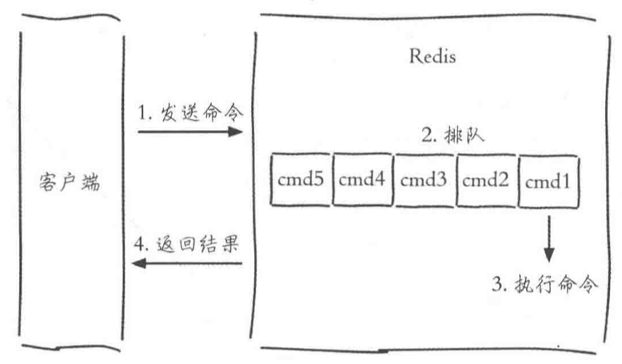

# Redis 学习笔记

## Redis的配置，启动，操作，关闭等。

Redis安装后，会有一些可执行文件被安装到/usr/local/bin目录下。

```shell
redis-server        # 启动Redis
redis-cli           # 客户端
redis-benchmark     # Redis基准测试工具
redis-check-aof     # Redis AOF持久化文件检测和修复工具
redis-check-dump    # Redis RDB持久化文件检测和修复工具
redis-sentinel      # 启动 Redis Sentinel
```

#### 启动

建议使用一下方法启动Redis

```shell
redis-server 配置文件.conf
```

#### 客户端连接服务器

使用redis-cli客户端可以链接服务器

```shell
redis-cli -h 127.0.0.1 -p 6379
```

也可以直接在后面增加命令行来取数据，如: 

```shell
redis-cli -h 127.0.0.1 -p 6379 command
```

redis-cli客户端是默认认为连接的是127.0.0.1和6379上的server，如果不加-h和-p也是可以的。

#### 关闭

```shell
redis-cli shutdown # 关闭redis服务器
```

```shell
redis-cli shutdown nosave | save # 是否在关闭之前生成持久化文件
```

## Redis API

简单的命令

```shell
set 键 值    # 设置某个键 对应某个 值
get 键        # 获得某个键对应的值

keys *      # 遍历每个键，显示所有键，O(n)
dbsize       # 键总数 O(1)

exists 键    # 判断某个键是否存在，返回int类型的，1为存在
del 键       # 删除某个键，可以连续删除多个键

expire 键 时间 # 将某个键设置为过一段时间后过期，过期后将被自动删除
expireat 键 时间戳 # 到对应时间戳时失效
ttl 键       # 获得某个键还能存活多久 -1为改键永远存在，-2为键不存在，其他为剩余时间

type 键      # 获得某个键下的值所对应的类型

mset 键 值 [键 值].... # 批量设置键值
mget 键 键 键 .....    # 批量获取键值

# 下面为比较不常用指令

append 键 值 # 在原有的键上添加对应的值，新值 = 原来值 + 需要添加的值
strlen 键    # 获得键对应值的长度
getset 键 值 # 设置某个键为某个值，如果键已经存在，则返回原来的键对应值
```

<font color=F0000> Redis执行效率非常高，但由于Redis是使用网络来进行传输指令， 所以指令的执行速度一定程度上也受网络影响，比如1000次get指令没有1次mget指令直接取1000个数据来的快。</font>

set指令有一些特殊选项，可以在设置键值的时候就设定选项

```shell
ex seconds: 为键设置秒级过期时间
px milliseconds: 为键设置毫秒级别过期时间
nx: 键必须不存在，用于添加新键
xx: 和nx相反，用于更新
```

例如:

```shell
set C++ Linux ex 10 # 设定键C++，值为Linux，存在10秒时间
set C++ Linux px 10 # 同上，存在10毫秒
set C++ Windows xx  # 更新C++的值为Windows
```

##### Redis数据类型

type命令可以看到的数据类型是Redis想让看到的数据类型，内部还有很多编码用来实现这种`数据结构`。

各种数据类型的使用API

* 哈希

有点类似Redis里再套Redis一样，都是键对应值，至需要在命令前加上h即可。

```shell
hset 键 哈希键 哈希值 [哈希键 哈希值] ..# 设定对应哈希键值对，可以批量设定
hget 键 哈希键 # 获取对应哈希键值对
hdel 键 哈希键 # 删除对应哈希键值对
hlen 键 # 计算对应哈希键值对长度
hmeget 键 哈希键 [哈希键] .. # 批量获取键值对
hmset 键 哈希键 哈希值 [哈希键 哈希值] ..# 同上
hexists 键 哈希键 # 判断对应哈希键是否存在
hkeys 键 # 获取所以哈希键
hvals 键 # 获取所有哈希值
hgetall 键 # 次命令也可以获取所有哈希值
```

<font color=F0000> 哈希内部有两种编码，ziplist(压缩列表)和hashtable(哈希表)。当哈希元素小于hash-max-ziplist-entries时(默认512)，使用ziplist，可以节省更多内存，但是数量过多时，或者对应哈希值长度大于64Bytes时，使用ziplist会降低读写效率，Redis将自动切换编码类型。 </font>

* 列表

列表大多用于实现栈或者队列的东西

```shell
rpush 键 值 [值].. # 右边加入
lpush 键 值 [值].. # 左边加入
lrange 键 索引开始，索引结束 # 如果想要拿到全部，可以将索引结束定位-1
linsert 键 before | after 值1 值2 # 在值1之前插入值2 ｜ 在值1之后插入值2
lindex 键 索引 # 获取对应索引的值
llen 键 # 获取对应列表长度

rpop 键 # 从右边删除一个元素
lpop 键 # 从左边删除一个元素
blpop 键 超时时间 # 堵塞从左边删除元素，如果没有元素就等待某个时间才返回
brpop 键 超时时间 # 同上

lrem 键 总数 值 # 当总数大于0时，从左到右删除最多count次对应值的元素，总数小于0则从右往左删除，总数为0则删除全部对应值。

ltrim 键 索引开始 索引结束 # 保留索引开始到索引结束的值，类似切片，范围为前闭后闭。
lset 键 索引 新值 # 为对应索引设定新值
```

<font color=F0000> 内部编码类似哈希表，当长度小于list-max-ziplist-entries(默认)使用512，值list-max-ziplist-value(默认64字节)，超出以上条件将使用链表来进行实现。 </font>

使用 lpush + brpop可以使得列表变成消息队列

* 集合

集合和哈希表以及列表不同的是不允许存在相同元素

```shell
sadd 键 值 [值].. # 添加集合值
srem 键 值 [值].. # 删除集合值
scard 键 # 计算集合长度，O(1)
sismember 键 值 # 判断对应集合值是否存在
# ... 其余API略
```

<font color=F0000> 内部编码类似哈希表，当长度小于set-max-ziplist-entries(默认512)且都是整数时，将使用整数集合，超出以上条件将使用哈希表来进行实现。 </font>

* 有序集合

略

##### Redis的键管理

```shell
rename 键 新键 # 重命名键的名字，如果新键已经存在，会覆盖掉
renamex 键 新键 # 同上，不同的是新键已经存在则返回0失败
randomkey # 返回一个随机键
```

##### 单线程架构

三个客户端同时发起执行命令

```shell
# incr使得键对应值自增1，成功返回1，失败返回错误，如果不存在则创建对应键值
incr counter    # 客户端1
incr counter    # 客户端2
incr counter    # 客户端3
```

这些命令将同时发送到Redis服务器，不过执行指令将放到执行队列中去，具体执行顺序将有指令到达时间来决定(取决于网络延迟等)。



Redis使用了PipeLine的技术来解决这种问题，将一组命令组合合并起来发送到Redis服务器，服务器分批执行后一起返回给客户端。


需要注意，这种pipeline命令并不是原子性的，而原生如mget命令是原子性命令。并且Pipeline也不是没有缺点，如果承载的命令过多，也会因为执行时间过长而让客户端等待过久。


##### 数据分库

Redis默认存在16个数据库，各个数据库之间没有任何关联，每个数据库可以有自己的相同键等等。


```shell
select 索引 # 进行数据库切换
flushdb # 删除当前数据库所在的数据
flushall # 删除所有数据库中的数据
```

如果数据库中的键过多，使用删除全部键的操作可能导致其他客户端请求被阻塞。


## 事务

Redis也有事务功能

```shell
multi # 事务开始
# 此处为命令
exec # 事务结束
```

如果执行到了一半，想要中断事务，可以使用

```shell
multi
discard # 中断事务
```

如果执行发生错误，则事务将被强制结束。

需要注意的是，如果错误的是逻辑错误，而不是语法错误，那么事务将继续执行，比如A关注B写成了A关注C，由于语法没有错误，所以事务正常执行，但是Redis并不支持回滚操作！


